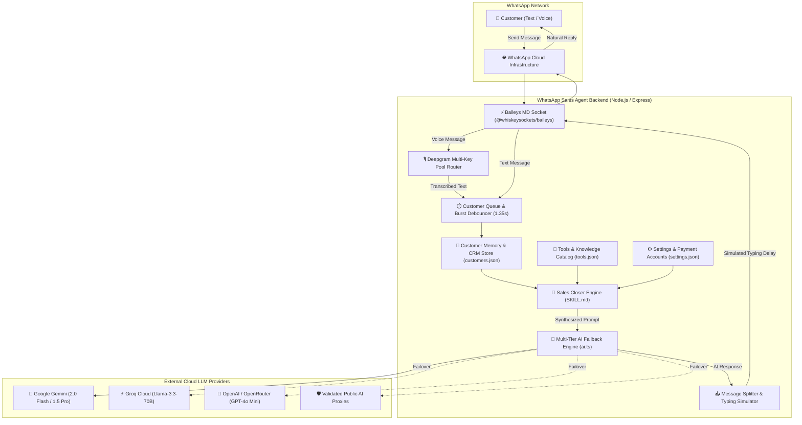
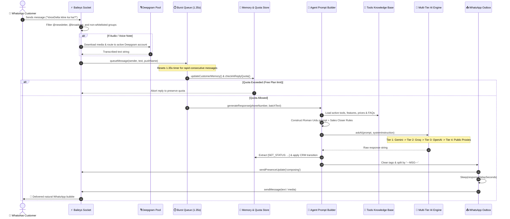
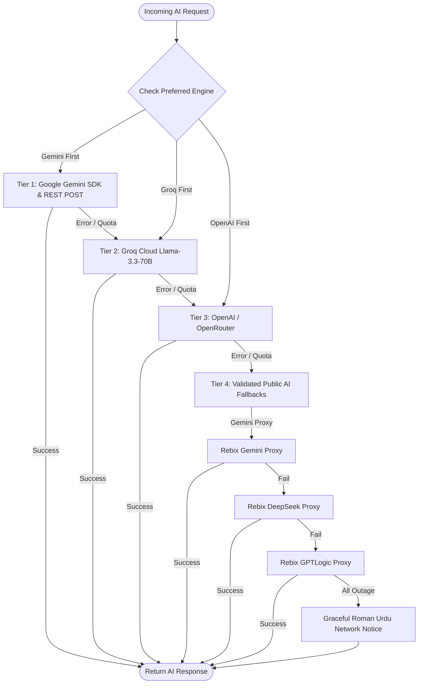
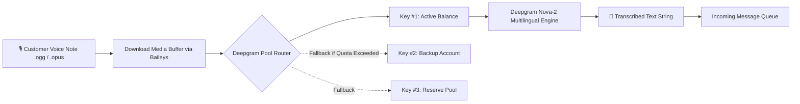
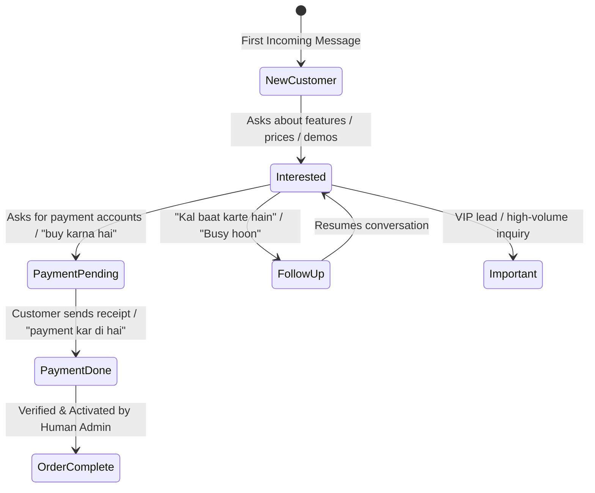

# 🏛️ Complete System Architecture & Workflow Guide

An in-depth technical guide to the internal architecture, data structures, tool knowledge ingestion, AI prompt synthesis, and end-to-end message lifecycles of the **WhatsApp AI Sales & Support Agent**.

---

## 📑 Table of Contents
1. [High-Level Architecture Overview](#1-high-level-architecture-overview)
2. [Complete End-to-End Message Lifecycle](#2-complete-end-to-end-message-lifecycle)
3. [Tools Knowledge Base & Ingestion Engine](#3-tools-knowledge-base--ingestion-engine)
4. [AI Prompt Synthesis & Closer Skill Engine](#4-ai-prompt-synthesis--closer-skill-engine)
5. [Multi-Tier LLM Fallback & Failover Architecture](#5-multi-tier-llm-fallback--failover-architecture)
6. [Voice Note Processing (Deepgram Multi-Account Pool)](#6-voice-note-processing-deepgram-multi-account-pool)
7. [Customer CRM State Machine & Memory Pipeline](#7-customer-crm-state-machine--memory-pipeline)
8. [Anti-Ban Protection & Natural WhatsApp Delivery](#8-anti-ban-protection--natural-whatsapp-delivery)
9. [Campaign & Bulk Outreach Engine](#9-campaign--bulk-outreach-engine)
10. [JSON Data Store Specifications](#10-json-data-store-specifications)

---

## 1. High-Level Architecture Overview

The system is built as a single-node, multi-tenant capable TypeScript service hosting both an **Express REST API backend** with **Baileys WhatsApp Socket** and a **React 19 single-page administration dashboard**.



---

## 2. Complete End-to-End Message Lifecycle

Here is the exact step-by-step sequence executed whenever an incoming message arrives:



---

## 3. Tools Knowledge Base & Ingestion Engine

### Where Tools Are Stored
Tools and software products are stored in [`data/tools.json`](file:///d:/Git%20Tools/salesagent/data/tools.json).

### Tool Schema
Each tool entry contains comprehensive structured metadata:

```json
{
  "id": "tool_voicedelta_1",
  "name": "VoiceDelta",
  "category": "Voice AI & TTS",
  "status": "active",
  "description": "Ultra-realistic AI voice generator with 3,600+ voices and instant 1-minute voice cloning.",
  "pricePkr": "1,199",
  "priceUsd": "5",
  "features": [
    "3,600+ AI voices across 140+ languages",
    "Instant 1-minute voice cloning with 99%+ fidelity",
    "Official models: ElevenLabs, ChatGPT/OpenAI, Gemini, Microsoft",
    "Commercial rights included with Pro plan"
  ],
  "use_cases": [
    "Faceless YouTube cash-cow channels",
    "TikTok & Instagram Reels voiceovers",
    "Audiobooks and corporate presentations"
  ],
  "limitations": [
    "Audio files are retained on server for 30 days"
  ],
  "how_to_use": "Login to dashboard, paste text or upload script, select voice model, and click Generate.",
  "sales_points": [
    "Costs 80% less than direct ElevenLabs subscription",
    "Instant activation upon payment screenshot"
  ],
  "faq": [
    {
      "question": "Is voice cloning available on the monthly plan?",
      "answer": "Yes, unlimited voice cloning is enabled on all Pro subscriptions."
    }
  ],
  "images": [
    {
      "id": "img_1",
      "filename": "voicedelta_dashboard.png",
      "filepath": "data/tool-images/voicedelta_dashboard.png",
      "title": "VoiceDelta Dashboard",
      "description": "Main user interface showing voice selection and cloning panel"
    }
  ]
}
```

### How the AI Ingests Tool Data
In [`src/server/agent.ts`](file:///d:/Git%20Tools/salesagent/src/server/agent.ts) (`generateResponse`), the tool repository is loaded dynamically:

```typescript
const tools = await getTools(userId);

const toolContext = tools.map((t) => {
  let block = `=== TOOL: ${t.name} ===\nCategory: ${t.category}\nStatus: ${t.status}\nDescription: ${t.description}`;
  if (t.pricePkr || t.priceUsd) {
    block += `\nPricing: ${t.pricePkr ? `Rs. ${t.pricePkr}/month` : ''} ${t.priceUsd ? `($${t.priceUsd}/mo)` : ''}`;
  }
  if (t.features?.length) block += `\nKey Features:\n` + t.features.map((f) => `  - ${f}`).join("\n");
  if (t.sales_points?.length) block += `\nSales Points:\n` + t.sales_points.map((s) => `  - ${s}`).join("\n");
  if (t.faq?.length) block += `\nFAQs:\n` + t.faq.map((q) => `  Q: ${q.question} -> A: ${q.answer}`).join("\n");
  if (t.images?.length) block += `\nAvailable Screenshots:\n` + t.images.map((img) => `  - Image File: "${img.filepath}" | Title: "${img.title}"`).join("\n");
  return block;
}).join("\n\n");
```

---

## 4. AI Prompt Synthesis & Closer Skill Engine

The prompt engineering architecture combines **Tool Knowledge**, **Conversation Memory**, and the **High-Converting Sales Closer Skill** ([`SKILL.md`](file:///d:/Git%20Tools/salesagent/SKILL.md)):

```
┌────────────────────────────────────────────────────────┐
│ 1. SYSTEM ROLE & PERSONA                               │
│    - Casual Pakistani WhatsApp sales representative    │
│    - Natural Roman Urdu (han bhai, scene ye hai, etc.) │
│    - Zero corporate jargon or robotic AI bullet points  │
├────────────────────────────────────────────────────────┤
│ 2. SALES CLOSER SKILL ENGINE (SKILL.md)                │
│    - Discovery before pitch (ask 1 diagnostic question)│
│    - Value Selling (translate feature -> outcome)      │
│    - Objection handling (Mehnga -> ROI, Later -> info) │
│    - 1-Step Closing (send payment info + screenshot)   │
├────────────────────────────────────────────────────────┤
│ 3. STORED TOOL KNOWLEDGE (SOURCE OF TRUTH)             │
│    - Features, Pricing, Limitations, FAQs              │
├────────────────────────────────────────────────────────┤
│ 4. OFFICIAL PAYMENT ACCOUNTS                           │
│    - Easypaisa, JazzCash, Raast, Bank Transfer         │
├────────────────────────────────────────────────────────┤
│ 5. RECENT CHAT HISTORY (LAST 20 MESSAGES)              │
│    - Customer and Agent past dialog                    │
├────────────────────────────────────────────────────────┤
│ 6. STRICT ANTI-REPETITION & PROGRESSIVE DISCLOSURE     │
│    - Never repeat known facts; reveal new points       │
├────────────────────────────────────────────────────────┤
│ 7. CUSTOMER'S NEW INCOMING MESSAGE(S)                  │
│    - Latest batch of customer text                     │
└────────────────────────────────────────────────────────┘
```

---

## 5. Multi-Tier LLM Fallback & Failover Architecture

The system guarantees **100% reply uptime** through a 4-tier fallback hierarchy ([`src/server/ai.ts`](file:///d:/Git%20Tools/salesagent/src/server/ai.ts)):



### Models Supported per Tier:
1. **Google Gemini (`callOfficialGemini`)**:
   - `gemini-2.0-flash`
   - `gemini-1.5-flash`
   - `gemini-1.5-pro`
   - `gemini-2.0-flash-lite`
   - *Dual invocation:* `@google/genai` SDK with automatic REST POST fallback.
2. **Groq Cloud (`callGroq`)**:
   - `llama-3.3-70b-versatile`
   - `llama-3.1-8b-instant`
   - `mixtral-8x7b-32768`
   - `gemma2-9b-it`
3. **OpenAI & OpenRouter (`callOpenAI`)**:
   - Direct: `gpt-4o-mini`, `gpt-4o`, `gpt-3.5-turbo`
   - OpenRouter: `meta-llama/llama-3.3-70b-instruct`, `deepseek/deepseek-chat`
4. **Public Proxies (`callPublicFallback`)**:
   - Compact query synthesizer ensuring zero truncation of customer intent.
   - Status & JSON error validation preventing false positive replies.

---

## 6. Voice Note Processing (Deepgram Multi-Account Pool)

Voice messages received over WhatsApp are automatically converted into text via the **Deepgram Multi-Account Router** ([`src/server/deepgram.ts`](file:///d:/Git%20Tools/salesagent/src/server/deepgram.ts)):



- **Health Checks:** Automatically polls Deepgram balance API every 5 minutes (`data/deepgram_accounts.json`).
- **Zero Interruption:** If one API key hits a rate limit or runs out of credits, traffic instantaneously routes to the next healthy key in the pool.

---

## 7. Customer CRM State Machine & Memory Pipeline

Customer interactions are tracked in [`data/customers.json`](file:///d:/Git%20Tools/salesagent/data/customers.json). The AI automatically infers and transitions customer buying states:



### Tag Parsing:
- If the AI detects a status shift, it appends `[SET_STATUS: <StatusName>]` to its internal output.
- The backend strips this tag before replying to the customer and writes the new status and status audit trail to [`data/customers.json`](file:///d:/Git%20Tools/salesagent/data/customers.json).

---

## 8. Anti-Ban Protection & Natural WhatsApp Delivery

To safeguard connected WhatsApp accounts from being flagged or banned:

1. **Burst Debouncing (1.35s):**
   When customers send multiple messages in rapid succession ("hi", "price?", "details"), the agent aggregates them into a single coherent prompt rather than firing 3 robotic replies.
2. **Natural WhatsApp Typing Simulation:**
   Before delivering responses, the agent broadcasts `sendPresenceUpdate('composing')` and pauses for `responseDelaySeconds` (configurable 1.0s – 3.5s).
3. **Multi-Message Splitting:**
   The AI splits distinct conversational thoughts using `---MSG---` delimiters, sending 2–3 crisp, bite-sized WhatsApp bubbles instead of a single wall of text.
4. **Channel & Broadcast Shielding:**
   Messages originating from `@newsletter` (WhatsApp Channels), `@broadcast`, or status updates are immediately discarded.
5. **Group Message Guard:**
   Group messages (`@g.us`) are blocked by default unless explicitly toggled on in settings.

---

## 9. Campaign & Bulk Outreach Engine

The Campaign subsystem ([`src/server/campaign.ts`](file:///d:/Git%20Tools/salesagent/src/server/campaign.ts)) allows controlled, compliant promotional broadcasts:

- **Config File:** [`data/campaign.json`](file:///d:/Git%20Tools/salesagent/data/campaign.json)
- **Target Selection:** Individual contacts or WhatsApp group members.
- **Safety Rate Limits:**
  - Configurable minimum interval (default: 20–30 seconds between outgoing messages).
  - Maximum messages per hour (default: 10–15).
  - Daily campaign cap.
- **Auto-Pause on Error:** If WhatsApp disconnects or an error threshold is hit, the campaign automatically pauses itself to protect the account.

---

## 10. JSON Data Store Specifications

All state is preserved in human-readable, hot-reloadable JSON files under `/data`:

| File | Purpose | Key Fields |
| :--- | :--- | :--- |
| [`data/settings.json`](file:///d:/Git%20Tools/salesagent/data/settings.json) | Global engine configuration | `aiAgentEnabled`, `preferredApi`, `geminiApiKey`, `groqApiKey`, `openAiApiKey`, `paymentMethods`, `responseDelaySeconds` |
| [`data/tools.json`](file:///d:/Git%20Tools/salesagent/data/tools.json) | Product & tool knowledge base | `name`, `pricePkr`, `priceUsd`, `features`, `use_cases`, `sales_points`, `faq`, `images` |
| [`data/customers.json`](file:///d:/Git%20Tools/salesagent/data/customers.json) | Customer CRM & message histories | `phoneNumber`, `name`, `status`, `messages`, `statusHistory`, `paymentClaimEvidence` |
| [`data/plans.json`](file:///d:/Git%20Tools/salesagent/data/plans.json) | SaaS subscription tiers | `name`, `pricePkr`, `aiRepliesMonthly`, `features` |
| [`data/usage.json`](file:///d:/Git%20Tools/salesagent/data/usage.json) | Token & reply consumption | `totalAiReplies`, `monthlyAiReplies`, `dailyAiReplies` |
| [`data/deepgram_accounts.json`](file:///d:/Git%20Tools/salesagent/data/deepgram_accounts.json) | Deepgram API key failover pool | `apiKey`, `label`, `balanceUsd`, `status`, `lastChecked` |
| [`data/campaign.json`](file:///d:/Git%20Tools/salesagent/data/campaign.json) | Active broadcast campaign state | `status`, `targetGroups`, `rateLimits`, `logs` |
| [`data/users.json`](file:///d:/Git%20Tools/salesagent/data/users.json) | Dashboard authentication users | `email`, `passwordHash`, `role`, `plan` |
